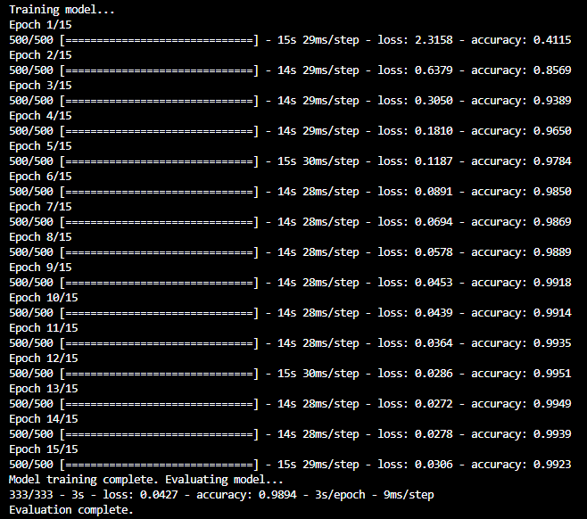

# Traffic sign reader
**Uses a Convolutional Neural Network to examine and categorise images of European traffic signs, using the [German Traffic Sign Recognition Benchmark](https://benchmark.ini.rub.de/?section=gtsrb&subsection=news) (GTSRB) dataset.**

The dataset contains 26640 labelled images taken in varied real-world conditions, in 43 categories of traffic signs. 
My current newtork parameterisation achieves a test accuracy of ~**99%** when attempting to categorize similar images.

Sample images from the GTSRB dataset: 

Sample training & testing run: 

I completed this project as part of [CS50AI](https://cs50.harvard.edu/ai/2020/), Harvard University's course in Artificial Intelligence in Python. Project requirements and key deliverables may be viewed [here](https://cs50.harvard.edu/ai/2020/projects/5/traffic/).

## To install
Clone the repository, then download the [GTSRB dataset](https://cdn.cs50.net/ai/2020/x/projects/5/gtsrb.zip) and place it in a folder in the root foler of the project.
Run `pip install -r requirements.txt`

## To run
`python traffic.py dataset_directory [model_name]`
where 'model_name' is an optional directory name into which the compiled model will be saved. If not specified, the model will not be saved.

## Note to CS50AI students & staff:
My implementation of this project is available here temporarily and solely for the purposes of demonstrating my abilities to potential employers. Viewing of this material by currently enrolled CS50AI students may constitute a violation of the course's [academic honesty policy](https://cs50.harvard.edu/ai/2020/honesty/).